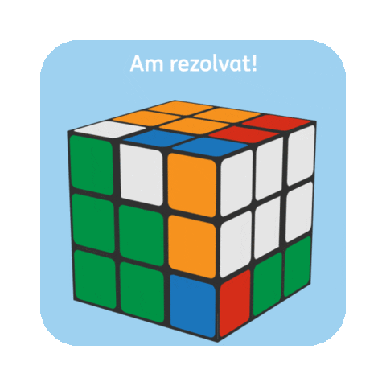

# Hi there👋, I'm <a href ="https://www.linkedin.com/in/eslam-ashraf-b70880216/">Eslam!</a>

  
  
   
   ### ”Pray for the best, prepare for the worst.⛰“
 
 

## 👨🏻‍💻 About Me 

- #### 🎓 Computer Engineering Student at <a href="http://eng.cu.edu.eg/ar/">Faculty of Engineering Cairo University</a>

- #### 🤖 Currently I am studding Machine Learning

- #### 👷🏼‍♂️ Software Engineer Intern <a href="https://www.bld.ai/">bld.ai</a>
- #### 👷🏼‍♂️ Software Engineer Trainer <a href="https://www.hdb-egy.com/">HD Bank</a>
- #### 📝 Checkout my <a href="https://drive.google.com/file/d/1Z9eIIxaEivHEZ3KX6Clf8PigdBK7E4lC/view?usp=sharing">Resume</a>

- #### 📫 How to reach me <a href="mailto:eslamashraf.12342@gmail.com">Mail</a>

- #### 🖐 Available to help

 

## Technical Skills

<ul>
<li>

### Programming languages:

 

<code title="Python"></code>
<code title="Java"></code>
<code title="C"></code>
<code title="C++"></code>
<code title="C#"></code>
<code title="arduino"></code>
<code title="opengl3"></code>
<code title="Assembly"></code>

</li>
<li>

### Frontend Development:

<code title="Html 5"></code>
<code title="CSS"></code>
<code title="SCSS"></code>
<code title="JavaScript"></code>
<code title="React.js"></code>
<code title="React + Vite"></code>
<code title="Vue.js"></code>
<code title="Bootstrap"></code>
<code title="TailWind.css"></code>
<code title="MUI"></code>
<code title="firebase"></code>

 
</li>
<li>

### Backend && DataBase Development:

 

<code title="mongodb"></code>
<code title="Django"></code>
<code title="PHP"></code>
<code title="SQl"></code>
<code title="MySQL"></code>

 
</li>
<li>

### Software & Tools:

<code title="Git"></code>
<code title="GitHub"></code>
<code title="StackOverflow"></code>

 
</li>
<li>

### Operating Systems:

<code title="Linux"></code>
<code title="Windows"></code>
<code title="VMware"></code>

</ul>
 
</li>

## 📫 Connect with me: 

 

  
  
  
 
       
   
       
   

 

 

 

